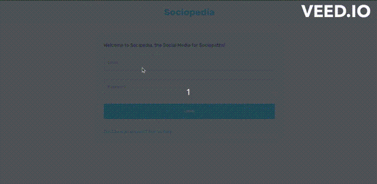

## Social Media App using MERN Stack, Redux and JSON Web Token
<br/>
<p align="center">
  
  
  
  
  
  
  <br/>
   
 
</p>


MERN Stack Social Media App is a clone of today's most popular social media- Instagram which has attractive responsive UI and amazing features.


#### Features

- Responsive Design: This will provide a consistent and user-friendly
experience, whether accessed from a desktop computer, tablet, or
mobile device.

- Authorization and Authentication: This will require users to create
accounts and log in securely, protecting their personal information and
ensuring that only authorized users have access to the app's features
and functionalities.

- Dark/Light Mode: Sociopedia will offer a dark and light mode option
for users to customize their app interface based on their preference.

- Like Facility: Users will have the ability to like and express their
appreciation for posts made by other users.

- Add/Remove Friends: Sociopedia will allow users to connect with
others by adding friends or accepting friend requests.

- Add Posts: Sociopedia will provide users with the ability to create and
share posts. Users can compose text-based posts, upload images or
videos, and include relevant links.

- Attractive GUI: The Sociopedia app will prioritize an attractive and
intuitive graphical user interface (GUI).


#### Technology Stack

- React 18.2.0
- Redux 8.0.7
- axios 1.4.0
- Express 4.18.2
- Mongoose 7.0.3
- MongoDB Atlas
- jsonwebtoken 9.0.0


## Detailed Steps - Introduction

### Installation

Execute the following command -

```

client side 

// first install all necessary dependencies
npm install

// next run
npm run start

Application starts running on `http://localhost:3000`

<br/>

server side 

//you need to create an account on MongoDB Atlas and use that as a database.

// first install all necessary dependencies
npm install

// next run
npm run dev


Application starts running on `http://localhost:3001`


```


<br/>

<p align="center">
<sub>Thank you, Vaishali Ajmera</sub>
</p>

